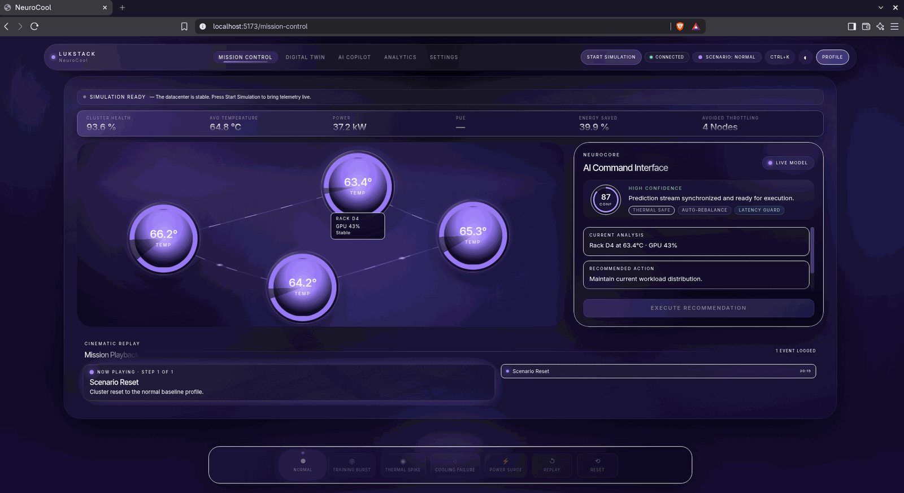
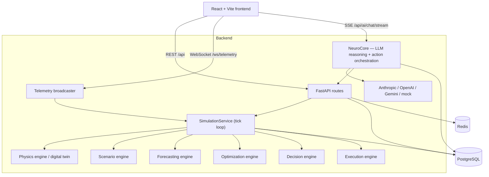
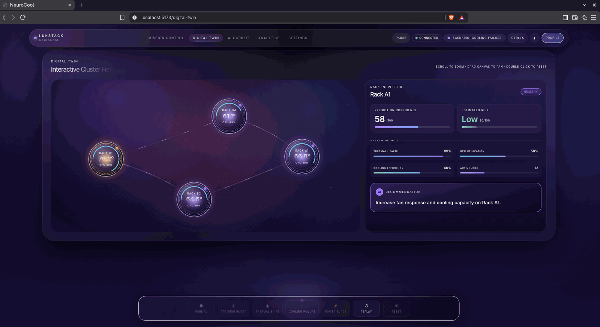
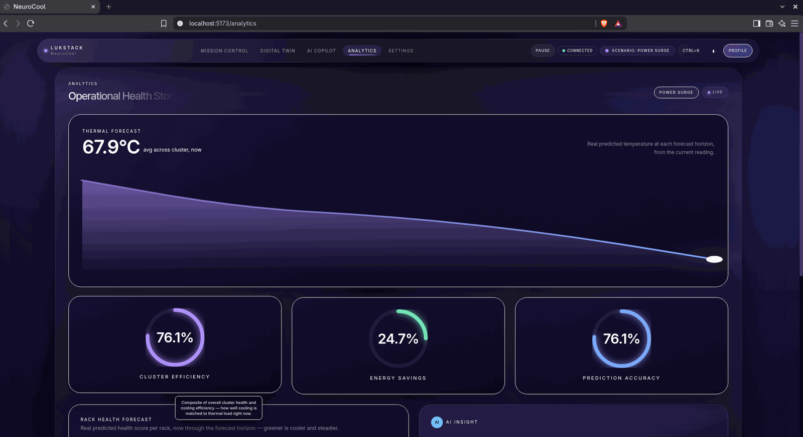
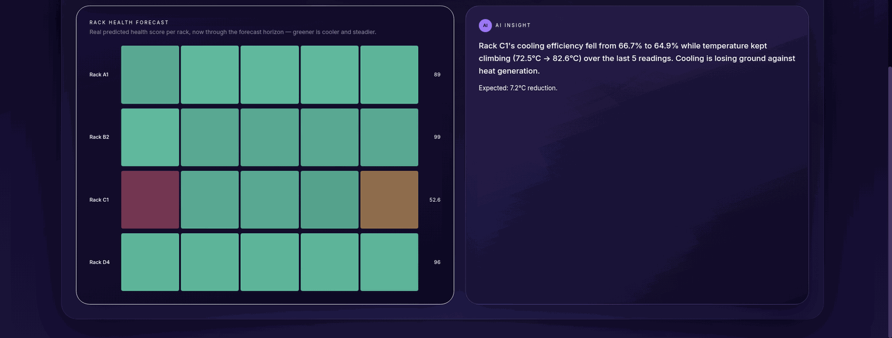
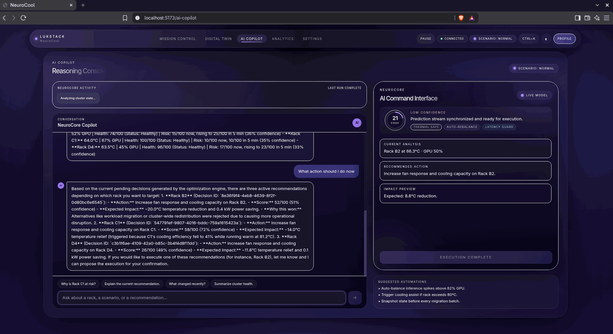
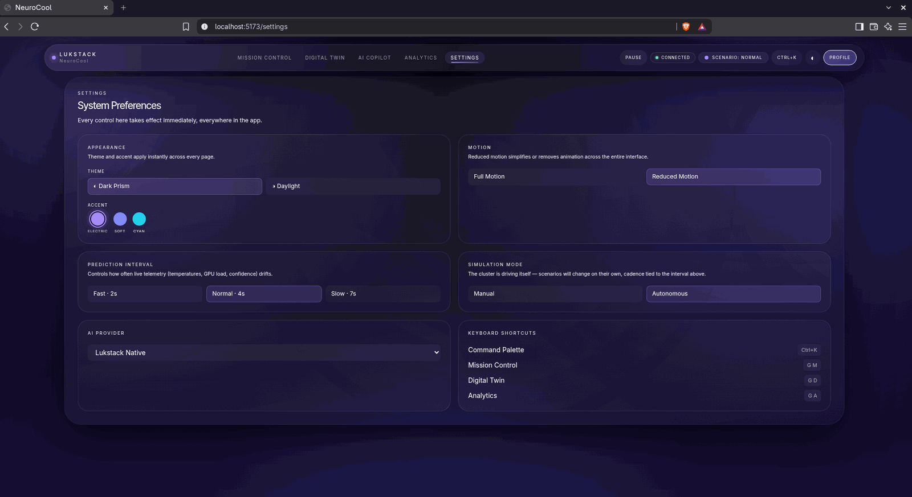

<div align="center">

# NeuroCool

**An AI-assisted thermal operations platform for GPU compute clusters — live digital twin, predictive forecasting, closed-loop remediation, and an LLM copilot.**

[](LICENSE)
[](backend/)
[](backend/)
[](Frontend/)
[](Frontend/)
[](backend/tests/)



</div>

---

## Overview

NeuroCool models a rack-scale GPU cluster as a **live digital twin** and runs a stack of
independent engines on top of it:

- A **physics-based simulation** generates organic, second-by-second telemetry — workload
  drives power, power drives heat, and a fan/cooling negative-feedback loop pulls temperature
  back toward a target. Nothing jumps between ticks.
- A **forecasting engine** maintains rolling history and projects each rack's temperature and
  risk out across several horizons.
- An **optimization engine** generates candidate cooling/workload plans every cycle, scores
  them, and selects a winner.
- A **decision engine** turns rule evaluations into durable, deduplicated, lifecycle-managed
  recommendations.
- An **execution engine** closes the loop: accepting a recommendation feeds remediation
  actions straight back into the same physics step.
- **NeuroCore**, the LLM layer, grounds a chat copilot in live cluster state and can *propose*
  actions — but a write is never executed from inside a chat turn; it only ever creates a
  pending action that a human confirms explicitly.

Every engine is swappable by construction (dependency injection) — the rule-based decision
engine, the trend forecaster, and the heuristic optimizer are all just the *current*
implementation of a contract.

The simulation **never auto-starts**. The backend always boots idle; a human starts the twin
via `POST /api/simulation/start` (or the button in the UI).

## Architecture



`SimulationService` owns the tick loop and is the single place that folds every engine's
contribution into the next physics step. See [`backend/README.md`](backend/README.md) for the
per-engine breakdown.

## Screenshots

### Mission Control
Live cluster overview — metrics ribbon, rack field, NeuroCore recommendation, and the event timeline.


### Digital Twin
Interactive pan/zoom rack field with a per-rack inspector; an at-risk rack (C1) is highlighted while a cooling-failure scenario runs.



### Analytics
Forward-looking thermal forecast anchored at the current reading, plus per-rack health-forecast bands and a generated insight.

| | |
| :---: | :---: |
|  |  |

### AI Copilot
Streaming reasoning console grounded in live state — every proposed action is a pending confirmation, never an automatic write.



### Settings
Theme, accent, motion, prediction interval, simulation mode, and AI provider — all applied live.



## Tech stack

| Layer | Technology |
| --- | --- |
| Frontend | React 19, TypeScript, Vite 8, Tailwind CSS 3, Framer Motion, React Router 7 |
| Backend | FastAPI, Python 3.12, SQLAlchemy 2.0 (async), Alembic, Pydantic v2 |
| Data | PostgreSQL 16, Redis 7 |
| Realtime | WebSocket (telemetry broadcast), Server-Sent Events (streaming chat) |
| AI providers | Anthropic, OpenAI, Google Gemini, deterministic mock |
| Tooling | Docker / Podman Compose, pytest (319 tests) |

## Getting started

### Prerequisites

- **Docker** or **Podman** with Compose
- **Node.js 20+** and npm (only needed to run the frontend outside a container)
- Optionally, **Python 3.12+** to run the backend without containers

### Option A — full stack with Podman (one command)

```bash
podman compose up --build          # or: podman-compose up --build
```

Brings up PostgreSQL, Redis, the API, and the built frontend together:

- Frontend → **http://localhost:3000**
- API → **http://localhost:8000** (docs at **/docs**)

See [`podman-compose.yml`](podman-compose.yml) and [`Dockerfile.frontend`](Dockerfile.frontend).

### Option B — backend in containers, frontend on the host

#### 1. Backend

```bash
cd backend
docker compose up --build        # or: podman compose up --build
```

This starts PostgreSQL, Redis, and the API. Migrations run automatically on startup.
The API is then at **http://localhost:8000** — interactive docs at
**http://localhost:8000/docs**.

The stack ships with safe defaults, so no `.env` file is required. To override anything
(database password, AI keys, timeouts), copy `backend/.env.example` to `backend/.env`.

#### 2. Frontend

From the **repository root** (the Vite project lives at the root; source is under `Frontend/`):

```bash
cp .env.example .env             # optional — defaults point at localhost:8000
npm install
npm run dev
```

Open **http://localhost:5173**. Click **Start** in the simulation dock to bring the digital
twin online.

### (Optional) Enable the AI copilot

Set a provider and key in `backend/.env` and restart the backend:

```env
AI_PROVIDER=gemini            # anthropic | openai | gemini | mock
GEMINI_API_KEY=your-key-here
```

Without a key, every other feature works unchanged and `/api/ai/chat` returns a clear
"unavailable" response.

### Running the backend without containers

```bash
cd backend
python -m venv .venv && source .venv/bin/activate
pip install -r requirements.txt
# point POSTGRES_* / REDIS_* at your own instances, then:
alembic upgrade head
uvicorn app.main:app --reload
```

## Configuration

Backend settings are environment variables (see `backend/.env.example` for the full list):

| Variable | Default | Purpose |
| --- | --- | --- |
| `BACKEND_CORS_ORIGINS` | `http://localhost:5173,http://localhost:3000` | Comma-separated allowed origins |
| `POSTGRES_*` | `neurocool` / `db:5432` | Database connection |
| `REDIS_*` | `redis:6379` | Redis connection |
| `SIMULATION_TICK_SECONDS` | `1.0` | Digital-twin recompute + broadcast interval |
| `AI_PROVIDER` | `anthropic` | `anthropic` \| `openai` \| `gemini` \| `mock` |
| `ANTHROPIC_API_KEY` / `OPENAI_API_KEY` / `GEMINI_API_KEY` | _(unset)_ | Provider credentials — optional |
| `AI_REQUEST_TIMEOUT_SECONDS` | `30` | Per-LLM-call timeout |
| `AI_STREAM_TIMEOUT_SECONDS` | `60` | Hard ceiling on one streamed chat turn |

Frontend settings (Vite, `VITE_`-prefixed — see `.env.example`):

| Variable | Default | Purpose |
| --- | --- | --- |
| `VITE_API_URL` | `http://localhost:8000` | Backend REST base URL |
| `VITE_WS_URL` | derived from `VITE_API_URL` | Backend WebSocket base URL |

## API reference

All REST routes are under `/api`; full schema at `/docs`.

| Area | Endpoints |
| --- | --- |
| Health | `GET /health` |
| Cluster & racks | `GET /api/cluster`, `GET /api/racks`, `GET /api/racks/{id}` |
| Simulation | `GET /api/simulation`, `POST /api/simulation/{start,pause,resume,reset}` |
| Scenarios | `GET /api/scenarios`, `GET/POST /api/scenario`, `POST /api/scenario/{reset,replay}` |
| Forecasting | `GET /api/forecast`, `GET /api/forecast/racks`, `GET /api/forecast/racks/{id}` |
| Decisions | `GET /api/decisions`, `POST /api/decisions/{id}/{accept,reject,execute}` |
| Executions | `GET /api/executions`, `GET /api/executions/{id}` |
| Optimization plans | `GET /api/plans`, `GET /api/plans/latest`, `GET /api/plans/{id}` |
| AI copilot | `GET /api/ai/providers`, `POST /api/ai/chat`, `POST /api/ai/chat/stream`, `POST /api/ai/actions/{id}/{confirm,cancel}` |
| Realtime | `WS /ws/telemetry` |

**Scenarios:** Normal · Training Burst · Thermal Spike · Cooling Failure · Power Surge.

## Project structure

```
NeuroCool/
├── Frontend/               # React app source (Mission Control, Digital Twin, Analytics, AI Copilot, Settings)
│   ├── lib/                # typed REST client, WS client, SSE client, env config
│   ├── pages/              # workspace views
│   ├── scenario/           # client-side scenario engine
│   └── state/              # live telemetry context (WebSocket)
├── backend/
│   ├── app/
│   │   ├── api/            # thin FastAPI route wrappers
│   │   ├── simulation/     # digital twin, physics, scenario manager
│   │   ├── forecasting/    # predictive thermal engine
│   │   ├── optimization/   # planning + scoring engine
│   │   ├── ai/             # rule-based decision engine + DecisionService
│   │   ├── execution/      # closed-loop remediation
│   │   ├── neurocore/      # LLM reasoning, tools, provider adapters
│   │   ├── models/         # SQLAlchemy ORM
│   │   └── websocket/      # telemetry broadcaster
│   ├── alembic/            # migrations
│   └── tests/              # 319 pytest tests
├── docs/screenshots/
├── podman-compose.yml     # full stack (db + redis + backend + frontend)
├── Dockerfile.frontend    # builds + serves the frontend bundle
├── index.html             # Vite entry (repo root)
├── vite.config.ts         # frontend build config (repo root)
└── package.json           # frontend deps + scripts (repo root)
```

## Testing

```bash
cd backend
pip install -r requirements.txt
pytest                       # 319 tests
alembic check                # verify zero migration drift
```

## License

[MIT](LICENSE) © 2026 Likhith Kumar B
